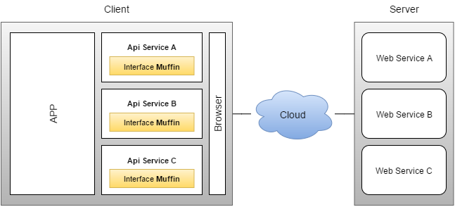

 Muffin
======

A simple api service to connect with one **Web as a Service**.




Inpiration
----------

The new web is more fast, agile and simple. Between new technology and new tendencies, the web requires more standards to make it scalable and versatile.

It for it that born **Muffin** a standard api to client that allow create a personal web as a service, and so enable ease the implementation your service.


Usage
-----

This is a set of methods predefined to create an api. This repository provides a set of methods to **JavaScript** as interfaces with support of **ES6**.


### URL Reference

> :warning: The URL Reference is recommended to developer, this **not** is a standard is only a recommendation the Muffin.

The Url Reference is a path to service. Is a good practice from control this reference is a structure simplified in sections.


 1. `https`: Server protocol connection.
 2. `myServer.com`: Hostname server.
 3. `path/service`: This is a path to the service.
 4. `model/data`: In general service have data models to manage data. this usually have a reference as ID or data name.
 5. `action`: Is defined the custom action, for example Update, Insert, Delete.
 6. `query=filter`: The service content can have configurations specific to call data. That often are defined in queries of parameters.


### Initialize an API service

```javascript
```
